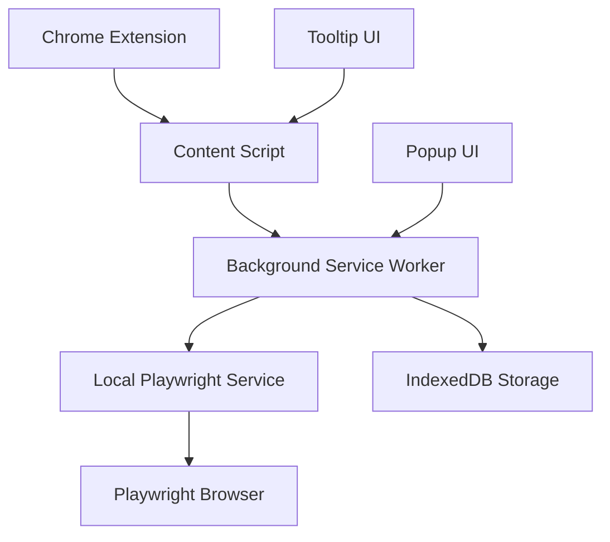

# 🎨 Frontend Developer Collaboration Guide

This guide is for frontend developers who want to collaborate on or integrate with the ToolTip Chrome Extension project.

## 📋 Project Overview

The ToolTip Chrome Extension is a fully local, privacy-first tooltip system that provides screenshot-based previews for web elements. It consists of:

- **Chrome Extension** (Manifest V3)
- **Local Playwright Service** (Node.js/Express)
- **Browser Storage** (IndexedDB)

## 🏗️ Architecture



## 📁 Codebase Structure

```
ToolTipCHROME-Local/
├── manifest-local.json          # Extension configuration
├── background-local.js          # Service worker (main logic)
├── content-local.js            # Content script (injected into pages)
├── popup-local.html            # Extension popup UI
├── popup-local.js              # Popup functionality
├── tooltip-styles.css          # Tooltip styling (glassmorphism theme)
├── icons/                      # Extension icons
├── screenshot-service/         # Local Playwright service
│   ├── server.js              # Express server
│   ├── playwright-scraper.js  # Screenshot capture logic
│   ├── cache-manager.js       # Cache management
│   └── package.json           # Service dependencies
└── docs/                      # Documentation
```

## 🎨 Design System

### Color Palette
```css
/* Primary Grey Theme */
--tooltip-bg: rgba(60, 60, 60, 0.95);
--tooltip-header: rgba(80, 80, 80, 0.8);
--tooltip-text: #f0f0f0;
--tooltip-border: rgba(255, 255, 255, 0.15);

/* Status Colors */
--success: rgba(76, 175, 80, 0.2);
--error: rgba(244, 67, 54, 0.2);
--warning: rgba(255, 152, 0, 0.2);
```

### Typography
- **Font Family**: -apple-system, BlinkMacSystemFont, 'Segoe UI', Roboto, sans-serif
- **Base Size**: 14px
- **Line Height**: 1.5
- **Font Weights**: 400 (normal), 500 (medium), 600 (semibold)

### Glassmorphism Effects
```css
background: linear-gradient(135deg, 
  rgba(80, 80, 80, 0.85) 0%, 
  rgba(60, 60, 60, 0.75) 50%, 
  rgba(40, 40, 40, 0.85) 100%);
backdrop-filter: blur(20px) saturate(180%);
border: 1px solid rgba(255, 255, 255, 0.15);
```

## 🔧 Development Setup

### Prerequisites
- Node.js 16+
- Chrome Browser
- Git

### Installation
```bash
# Clone the repository
git clone <repository-url>
cd ToolTipCHROME-Local

# Install service dependencies
cd screenshot-service
npm install
npx playwright install

# Start the service
node server.js
```

### Loading the Extension
1. Open Chrome → `chrome://extensions/`
2. Enable "Developer mode"
3. Click "Load unpacked"
4. Select the `ToolTipCHROME-Local` folder

## 🎯 Key Components

### 1. Content Script (`content-local.js`)
**Purpose**: Injected into web pages to detect elements and show tooltips

**Key Features**:
- Element detection and analysis
- Tooltip rendering and positioning
- Event handling (hover, click, focus)
- Screenshot capture requests

**Key Methods**:
```javascript
// Show tooltip for element
showTooltip(element, data)

// Handle element interactions
handleElementEnter(event)
handleElementClick(event)

// Extract element data
extractElementData(element)
```

### 2. Background Service Worker (`background-local.js`)
**Purpose**: Manages extension state, communicates with local service

**Key Features**:
- Settings management
- Screenshot capture coordination
- IndexedDB storage
- Service status monitoring

**Key Methods**:
```javascript
// Capture screenshot
captureScreenshotLocal(elementData)
captureWithPlaywrightService(elementData)

// Manage storage
storeScreenshot(screenshotData)
getExistingScreenshot(url)

// Check service status
checkServiceStatus()
```

### 3. Popup UI (`popup-local.html` + `popup-local.js`)
**Purpose**: Extension settings and status interface

**Key Features**:
- Settings configuration
- Service status monitoring
- Storage management
- Real-time status updates

### 4. Tooltip Styles (`tooltip-styles.css`)
**Purpose**: Glassmorphism-themed tooltip styling

**Key Features**:
- Responsive design
- Drag/resize functionality
- Loading states
- Error states
- Accessibility support

## 🚀 API Integration

### Local Playwright Service
The extension communicates with a local Express server:

**Endpoints**:
- `GET /health` - Service health check
- `POST /screenshot` - Capture screenshots
- `GET /cache/stats` - Cache statistics
- `DELETE /cache` - Clear cache

**Example Request**:
```javascript
const response = await fetch('http://localhost:3001/screenshot', {
  method: 'POST',
  headers: { 'Content-Type': 'application/json' },
  body: JSON.stringify({
    url: 'https://example.com',
    selector: 'button',
    elementType: 'button',
    maxScreenshots: 1
  })
});
```

### Chrome Extension APIs
- `chrome.tabs.captureVisibleTab()` - Fallback screenshot capture
- `chrome.storage.local` - Settings storage
- `chrome.scripting.executeScript()` - Page metadata extraction
- `chrome.runtime.sendMessage()` - Inter-component communication

## 🎨 UI/UX Guidelines

### Tooltip Design
- **Size**: 220px - 420px width, auto height
- **Position**: Smart positioning with viewport boundary detection
- **Animation**: Smooth fade-in/out with transform effects
- **Interactivity**: Draggable, resizable, collapsible

### Responsive Behavior
- Adapts to different screen sizes
- Handles viewport boundaries
- Supports both desktop and mobile Chrome

### Accessibility
- Keyboard navigation support
- Screen reader compatibility
- High contrast mode support
- Reduced motion preferences

## 🔄 State Management

### Settings Storage
```javascript
const defaultSettings = {
  enabled: true,
  triggerEvent: 'hover',
  showPreviews: true,
  interactiveTooltips: true,
  analysisMode: 'local',
  localScreenshots: {
    enabled: true,
    autoCapture: true,
    waitTime: 3000,
    maxStorageSize: 50 * 1024 * 1024,
    cleanupInterval: 7 * 24 * 60 * 60 * 1000
  }
};
```

### Screenshot Storage
```javascript
const screenshotData = {
  id: 'screenshot_1234567890_abc123',
  url: 'https://example.com',
  dataUrl: 'data:image/png;base64,...',
  metadata: { title: 'Page Title', description: '...' },
  timestamp: 1234567890,
  elementType: 'button'
};
```

## 🧪 Testing

### Manual Testing
1. Load extension in Chrome
2. Start local service
3. Visit test websites
4. Hover over different elements
5. Test tooltip interactions
6. Verify screenshot capture

### Test Scenarios
- Different element types (buttons, links, inputs)
- Various websites and layouts
- Service availability/offline states
- Storage limits and cleanup
- Error handling and fallbacks

## 🐛 Common Issues

### Service Not Running
- Check if `node server.js` is running
- Verify port 3001 is available
- Check console for errors

### Screenshots Not Capturing
- Verify service is accessible
- Check browser permissions
- Ensure target site allows screenshots

### Performance Issues
- Monitor storage usage
- Check for memory leaks
- Optimize screenshot quality/size

## 📝 Contributing

### Code Style
- Use modern JavaScript (ES6+)
- Follow Chrome Extension best practices
- Maintain consistent naming conventions
- Add comments for complex logic

### Pull Request Process
1. Fork the repository
2. Create feature branch
3. Make changes
4. Test thoroughly
5. Submit pull request

### File Naming
- Use kebab-case for files
- Prefix with component type (e.g., `popup-`, `content-`)
- Use descriptive names

## 🔗 Resources

- [Chrome Extension Documentation](https://developer.chrome.com/docs/extensions/)
- [Manifest V3 Migration](https://developer.chrome.com/docs/extensions/migrating/)
- [Playwright Documentation](https://playwright.dev/)
- [IndexedDB API](https://developer.mozilla.org/en-US/docs/Web/API/IndexedDB_API)

## 📞 Support

For questions or issues:
- Check the troubleshooting guide
- Review the main README
- Create an issue on GitHub
- Contact the development team

---

**Happy coding!** 🚀
