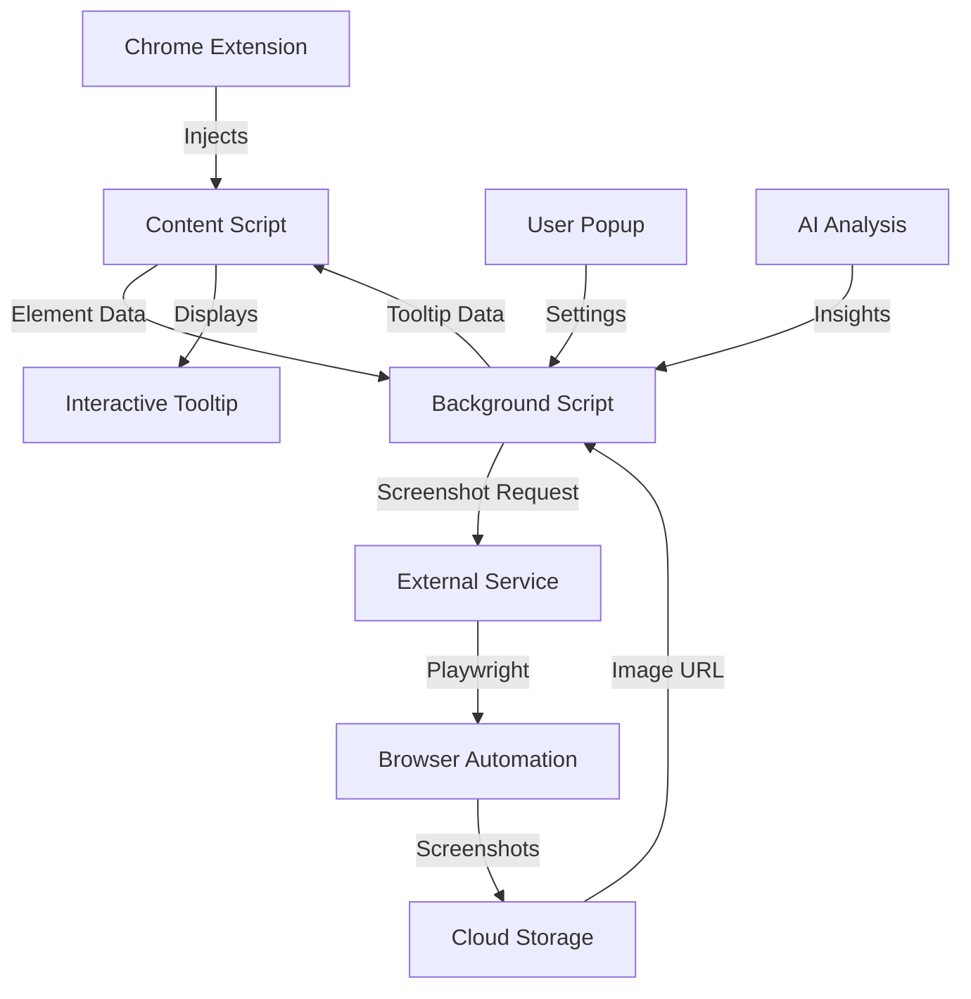

# 🔍 ToolTip Companion Chrome Extension

> **Beautiful interactive tooltips with AI-powered insights and screenshot previews**

[](https://chrome.google.com/webstore)
[](https://github.com/mcpmessenger/ToolTipCHROME/releases)
[](LICENSE)

## ✨ Features

### 🎨 **Beautiful Glassmorphism Design**
- **Modern grey theme** with gradients and blur effects
- **Rounded edges** and smooth animations
- **Responsive design** that adapts to any website
- **Dark/light mode** support

### 🖱️ **Interactive Tooltips**
- **Draggable** - Click and drag tooltips anywhere
- **Resizable** - 8 resize handles for precise control
- **Collapsible** - Minimize/expand functionality
- **Smart positioning** - Auto-adjusts to viewport boundaries

### 📸 **Screenshot Previews**
- **Automatic capture** when clicking links
- **Playwright-powered** screenshot service
- **Link previews** with page metadata
- **Clickable screenshots** to open links

### 🤖 **AI-Powered Analysis**
- **Local analysis** for privacy-focused users
- **API integration** for advanced insights
- **Element recognition** and smart tooltips
- **Confidence scoring** for analysis quality

## 🚀 Quick Start

### For Users
1. **Install Extension**: Download from Chrome Web Store (coming soon)
2. **Click any link** to see screenshot previews
3. **Hover over elements** for AI-powered insights
4. **Drag and resize** tooltips as needed

### For Developers
```bash
# Clone the repository
git clone https://github.com/mcpmessenger/ToolTipCHROME.git
cd ToolTipCHROME

# Install dependencies
npm install

# Start screenshot service (optional)
node screenshot-service.js

# Load extension in Chrome
# 1. Go to chrome://extensions/
# 2. Enable "Developer mode"
# 3. Click "Load unpacked"
# 4. Select this directory
```

## 🏗️ Architecture



## 📁 Project Structure

```
ToolTipCHROME/
├── 📁 extension/                 # Chrome Extension Files
│   ├── manifest.json            # Extension manifest
│   ├── background.js            # Service worker
│   ├── content.js               # Content script
│   ├── popup.html               # Extension popup UI
│   ├── popup.js                 # Popup functionality
│   ├── tooltip-styles.css       # Tooltip styling
│   └── 📁 icons/                # Extension icons
├── 📁 screenshot-service/        # External Screenshot Service
│   ├── screenshot-service.js    # Development service
│   ├── screenshot-service-production.js # Production service
│   ├── package.json             # Service dependencies
│   └── deployment-guide.md      # Deployment instructions
├── 📁 docs/                     # Documentation
│   ├── architecture-design.md   # System architecture
│   ├── collaboration-guide.md   # Developer collaboration
│   └── development-roadmap.md   # Future development
└── README.md                    # This file
```

## 🛠️ Development Setup

### Prerequisites
- **Node.js** 16+ for screenshot service
- **Chrome Browser** for extension testing
- **Git** for version control

### Local Development
```bash
# 1. Clone repository
git clone https://github.com/mcpmessenger/ToolTipCHROME.git
cd ToolTipCHROME

# 2. Install screenshot service dependencies
npm install

# 3. Install Playwright browsers
npx playwright install chromium

# 4. Start screenshot service (optional)
node screenshot-service.js

# 5. Load extension in Chrome
# - Go to chrome://extensions/
# - Enable Developer mode
# - Click "Load unpacked"
# - Select the extension folder
```

## 🎯 Current Status

### ✅ **Completed Features**
- [x] **Grey glassmorphism theme** with beautiful gradients
- [x] **Draggable and resizable tooltips** with smooth animations
- [x] **Collapsible interface** with minimize/expand
- [x] **Screenshot capture service** using Playwright
- [x] **Link preview functionality** with metadata
- [x] **Error handling** and graceful fallbacks
- [x] **Production-ready service** for hosting
- [x] **Rate limiting** and security features

### 🚧 **In Progress**
- [ ] **Chrome Web Store submission**
- [ ] **User documentation** and tutorials
- [ ] **Performance optimization**
- [ ] **Additional AI analysis modes**

### 📋 **Planned Features**
- [ ] **GIF generation** for interaction previews
- [ ] **Custom tooltip themes**
- [ ] **Keyboard shortcuts**
- [ ] **Analytics dashboard**
- [ ] **Premium features**

## 🤝 Contributing

We welcome contributions! Please see our [Collaboration Guide](docs/collaboration-guide.md) for details.

### Development Workflow
1. **Fork** the repository
2. **Create** a feature branch (`git checkout -b feature/amazing-feature`)
3. **Commit** your changes (`git commit -m 'Add amazing feature'`)
4. **Push** to the branch (`git push origin feature/amazing-feature`)
5. **Open** a Pull Request

## 📖 Documentation

- **[Architecture Design](docs/architecture-design.md)** - System overview and design decisions
- **[Collaboration Guide](docs/collaboration-guide.md)** - Developer collaboration guidelines
- **[Development Roadmap](docs/development-roadmap.md)** - Future development plans
- **[Deployment Guide](screenshot-service/deployment-guide.md)** - Production deployment

## 🔧 Configuration

### Extension Settings
- **Trigger Event**: Hover, Click, or Focus
- **Tooltip Position**: Auto, Top, Bottom, Left, Right
- **Analysis Mode**: Local (privacy) or API (advanced)
- **Screenshot Service**: Enable/disable automatic captures
- **Interactive Features**: Draggable/resizable tooltips

### Screenshot Service
- **Rate Limiting**: 100 requests per 15 minutes
- **Screenshot TTL**: 24 hours (configurable)
- **Auto Cleanup**: Removes old screenshots hourly
- **Security**: CORS protection and input validation

## 🚀 Deployment

### Extension Deployment
1. **Package extension** for Chrome Web Store
2. **Submit for review** (typically 1-3 days)
3. **Monitor user feedback** and analytics

### Screenshot Service Deployment
See [Deployment Guide](screenshot-service/deployment-guide.md) for hosting options:
- **Heroku** (recommended for beginners)
- **DigitalOcean** (VPS hosting)
- **AWS/Google Cloud** (enterprise scale)
- **Docker** (containerized deployment)

## 📊 Analytics & Monitoring

### Service Health
- **Health Check**: `GET /api/health`
- **Service Info**: `GET /api/info`
- **Rate Limit Status**: Included in responses

### Extension Analytics
- **Usage metrics** (coming soon)
- **Error tracking** (coming soon)
- **Performance monitoring** (coming soon)

## 🔒 Security & Privacy

### Privacy First
- **Local analysis mode** - No data leaves your device
- **Optional API mode** - Only when explicitly enabled
- **No tracking** - We don't collect personal data
- **Open source** - Full transparency

### Security Features
- **Rate limiting** prevents abuse
- **Input validation** and sanitization
- **CORS protection** for API endpoints
- **HTTPS only** for production services

## 📞 Support

- **Issues**: [GitHub Issues](https://github.com/mcpmessenger/ToolTipCHROME/issues)
- **Discussions**: [GitHub Discussions](https://github.com/mcpmessenger/ToolTipCHROME/discussions)
- **Email**: [Contact via GitHub](https://github.com/mcpmessenger/ToolTipCHROME)

## 📄 License

This project is licensed under the MIT License - see the [LICENSE](LICENSE) file for details.

## 🙏 Acknowledgments

- **Playwright** for browser automation
- **Chrome Extension APIs** for extension functionality
- **Open source community** for inspiration and tools

---

**Built with ❤️ for a better web browsing experience**

[⭐ Star this repository](https://github.com/mcpmessenger/ToolTipCHROME) if you find it helpful!
