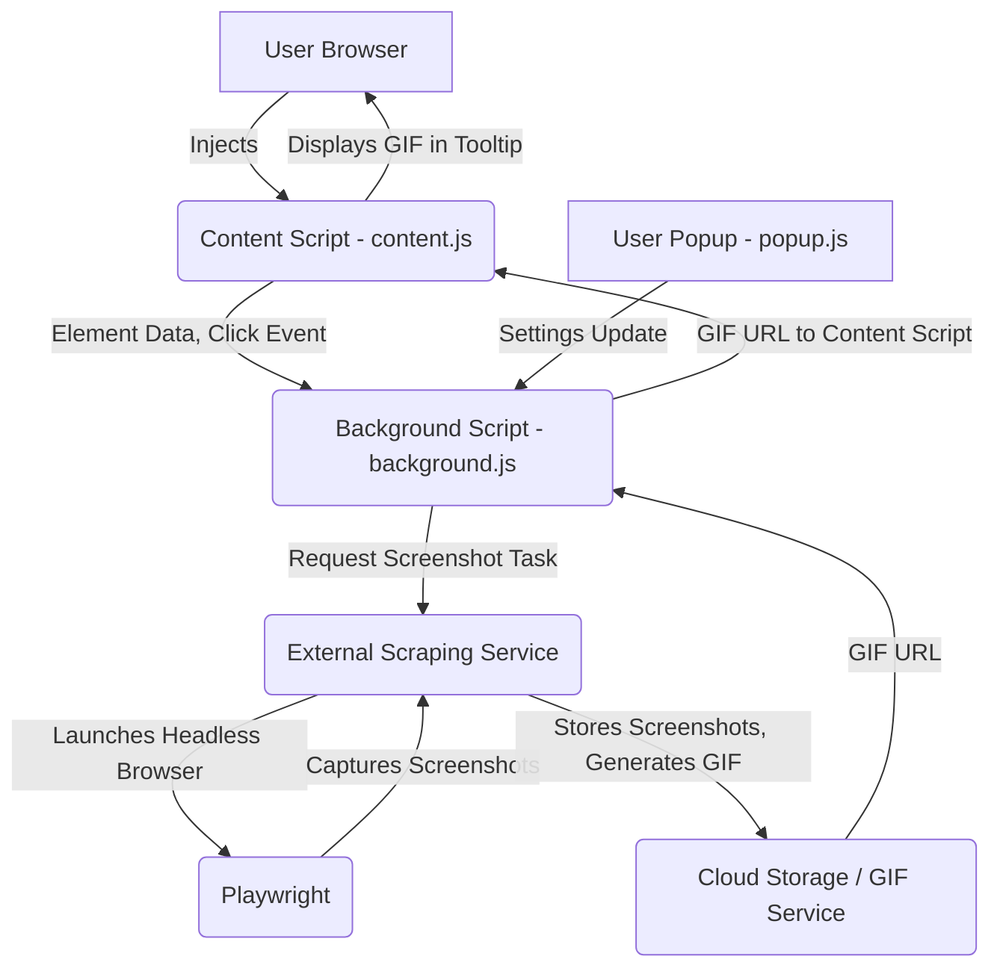

# Enhanced ToolTip Companion Architecture Design

## 1. Introduction

This document outlines the proposed architectural enhancements for the ToolTip Companion Chrome extension. The primary goal is to integrate advanced screenshot capture capabilities, similar to those observed in `tooltipcompanion.com`, allowing the extension to record user interactions (specifically button clicks) and generate animated GIF previews. This will provide users with a dynamic visual representation of the outcome of an interaction before they commit to it.

## 2. Current Architecture Overview

The existing ToolTip Companion extension comprises several key components:

*   **`manifest.json`**: Defines the extension's metadata, permissions (`activeTab`, `scripting`, `storage`), and entry points (`background.js`, `content.js`, `popup.html`).
*   **`background.js`**: Operates as a service worker, handling extension-wide events, managing settings (enabled, trigger event, analysis mode, API details), and performing local or API-based analysis of interactive elements. It communicates with content scripts and the popup.
*   **`content.js`**: Injected into web pages, it observes the DOM for interactive elements, attaches event listeners (hover, click, focus), extracts element data, and sends it to `background.js` for analysis. It also manages the display and positioning of the tooltip UI.
*   **`popup.html` / `popup.js`**: Provides the user interface for configuring extension settings, such as enabling/disabling the extension, setting trigger events, and configuring API access.
*   **`tooltip-styles.css`**: Styles the tooltip elements injected by `content.js`.

## 3. Proposed Enhancements and New Capabilities

The enhanced architecture will introduce the following new capabilities:

*   **Click-triggered Screenshot Capture**: When a user interacts with a designated element (e.g., clicks a button), a sequence of screenshots will be captured to illustrate the resulting state change.
*   **External Scraping Service**: Due to Chrome extension limitations, a dedicated external service will be responsible for orchestrating browser automation (using Playwright) to capture screenshots.
*   **Screenshot Storage**: Captured screenshots will be temporarily stored, likely on the external service or a cloud storage solution, before being processed.
*   **GIF Generation**: The sequence of screenshots will be compiled into an animated GIF.
*   **GIF Preview in Tooltips**: The generated GIF will be displayed within the extension's tooltip, offering a rich preview of the interaction's outcome.

## 4. High-Level Architectural Diagram

## 5. Detailed Component Design

### 5.1. Content Script (`content.js`) Modifications

**Current Role**: Detects interactive elements, extracts data, and requests analysis from `background.js`.

**New Responsibilities**:
*   **Enhanced Event Listener**: In addition to existing `hover`, `click`, and `focus` listeners, a new mechanism will be implemented to specifically detect 

clicks that should trigger a screenshot sequence. This could be based on a specific user action (e.g., a modifier key + click) or a setting in the popup.
*   **Communicate Click Events**: When a designated click event occurs, `content.js` will send a message to `background.js` containing the element's details and a request to initiate a screenshot capture sequence.
*   **Receive and Display GIFs**: `content.js` will be updated to handle incoming GIF URLs from `background.js`. It will then dynamically create or update the tooltip to display the animated GIF.

### 5.2. Background Script (`background.js`) Modifications

**Current Role**: Manages settings, orchestrates analysis, and communicates between components.

**New Responsibilities**:
*   **Handle Screenshot Requests**: It will listen for screenshot capture requests from `content.js`.
*   **Interface with External Service**: Upon receiving a request, `background.js` will make an API call to the external scraping service, passing the necessary information (target URL, element selector, etc.).
*   **Manage GIF URLs**: It will receive the generated GIF URL from the external service and forward it to the appropriate `content.js` instance.
*   **Caching**: To improve performance and reduce redundant scraping, `background.js` could implement a caching mechanism for generated GIFs, keyed by the target URL and element selector.

### 5.3. External Scraping Service (New Component)

This will be a new, standalone service responsible for the heavy lifting of browser automation and screenshot capture. It will be implemented as a simple web server (e.g., using Node.js with Express or a similar framework).

**Key Features**:
*   **API Endpoint**: It will expose an API endpoint (e.g., `/scrape`) that accepts requests from the Chrome extension's `background.js`.
*   **Playwright Integration**: The service will use Playwright to launch a headless browser, navigate to the specified URL, and interact with the page.
*   **Screenshot Logic**: It will contain the logic to perform the following steps:
    1.  Navigate to the target URL.
    2.  Locate the specified element.
    3.  Capture a 

screenshot of the initial state (before the click).
    4.  Simulate a click on the element.
    5.  Wait for the page to update (e.g., by waiting for a navigation event or a specific element to appear).
    6.  Capture a screenshot of the final state (after the click).
*   **GIF Generation**: The service will use a library (e.g., `gif-encoder`, `jimp`) to combine the initial and final screenshots into an animated GIF.
*   **Storage**: The generated GIF will be temporarily stored (e.g., in a local directory or a cloud storage bucket like Amazon S3) and a public URL will be returned to the `background.js`.

### 5.4. Data Flow

The end-to-end data flow for the screenshot capture and GIF preview feature will be as follows:

1.  The user performs a designated click action on an interactive element in their browser.
2.  `content.js` captures this event and sends a message to `background.js` with the element's details (URL, selector).
3.  `background.js` sends a request to the external scraping service's API endpoint, providing the target URL and element selector.
4.  The external service launches Playwright, navigates to the URL, and captures 'before' and 'after' screenshots of the click interaction.
5.  The service generates a GIF from the screenshots and stores it, returning the public URL of the GIF to `background.js`.
6.  `background.js` forwards the GIF URL to `content.js`.
7.  `content.js` updates the tooltip to display the animated GIF, providing the user with a preview of the interaction.

## 6. Potential Challenges and Mitigations

*   **Security**: The external scraping service must be secured to prevent unauthorized access and potential abuse. API keys and other authentication mechanisms will be necessary.
*   **Performance**: The process of launching a browser, navigating, and capturing screenshots can be time-consuming. The user will experience a delay between the click and the appearance of the GIF. To mitigate this, a loading indicator will be displayed in the tooltip, and caching will be implemented to avoid re-scraping the same interaction.
*   **Dynamic and Complex Websites**: Websites with complex JavaScript, asynchronous updates, and anti-scraping measures may pose challenges for Playwright. The scraping logic will need to be robust and include appropriate waiting mechanisms.
*   **Cost**: Hosting an external scraping service and cloud storage will incur costs. The usage of the service may need to be monitored and potentially limited.

## 7. Conclusion

The proposed architecture provides a clear path forward for integrating advanced screenshot and GIF generation capabilities into the ToolTip Companion extension. By offloading the heavy-lifting to an external service, we can overcome the limitations of the Chrome extension environment while providing a powerful and user-friendly feature. The next steps will involve implementing the external scraping service, modifying the existing extension components, and thoroughly testing the new functionality.

