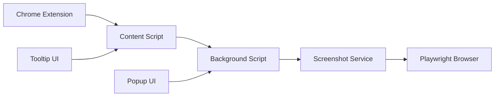

# 🤝 Collaboration Guide for Frontend Developers

Welcome to the ToolTip Companion project! This guide will help you understand the codebase, development workflow, and how to contribute effectively.

## 📋 Project Overview

**ToolTip Companion** is a Chrome extension that provides beautiful, interactive tooltips with AI-powered insights and automatic screenshot previews. The project consists of two main components:

1. **Chrome Extension** - The main extension with UI and functionality
2. **Screenshot Service** - External service for capturing website screenshots

## 🏗️ Architecture Overview



## 📁 Codebase Structure

### Chrome Extension Files
```
extension/
├── manifest.json           # Extension configuration
├── background.js          # Service worker (main logic)
├── content.js            # Content script (injected into pages)
├── popup.html            # Extension popup UI
├── popup.js              # Popup functionality
├── tooltip-styles.css    # Tooltip styling (glassmorphism theme)
└── icons/                # Extension icons (16px, 32px, 48px, 128px)
```

### Screenshot Service
```
screenshot-service/
├── screenshot-service.js              # Development service
├── screenshot-service-production.js   # Production service
├── package.json                       # Dependencies
├── Dockerfile                         # Container setup
└── deployment-guide.md               # Hosting instructions
```

## 🎨 Design System

### Color Palette
```css
/* Primary Grey Theme */
--tooltip-bg: rgba(60, 60, 60, 0.95);
--tooltip-header: rgba(80, 80, 80, 0.8);
--tooltip-text: #f0f0f0;
--tooltip-border: rgba(255, 255, 255, 0.15);

/* Interactive Elements */
--btn-primary: rgba(120, 120, 120, 0.7);
--btn-hover: rgba(140, 140, 140, 0.8);
--btn-active: rgba(100, 100, 100, 0.9);
```

### Glassmorphism Effects
```css
.tooltip-companion-tooltip {
  background: linear-gradient(135deg, 
    rgba(80, 80, 80, 0.85) 0%, 
    rgba(60, 60, 60, 0.75) 50%, 
    rgba(40, 40, 40, 0.85) 100%);
  backdrop-filter: blur(20px) saturate(180%);
  border-radius: 16px;
  box-shadow: 
    0 20px 40px rgba(0, 0, 0, 0.3),
    0 8px 16px rgba(0, 0, 0, 0.2),
    inset 0 1px 0 rgba(255, 255, 255, 0.1);
}
```

## 🛠️ Development Setup

### Prerequisites
- **Node.js 16+** (for screenshot service)
- **Chrome Browser** (for extension testing)
- **Git** (for version control)

### Quick Start
```bash
# 1. Clone and setup
git clone https://github.com/mcpmessenger/ToolTipCHROME.git
cd ToolTipCHROME

# 2. Install dependencies
npm install
npx playwright install chromium

# 3. Start screenshot service (optional)
node screenshot-service.js

# 4. Load extension in Chrome
# - Go to chrome://extensions/
# - Enable Developer mode
# - Click "Load unpacked"
# - Select the project directory
```

## 🔧 Key Components

### 1. Content Script (`content.js`)
**Purpose**: Injected into web pages, handles tooltip display and user interactions.

**Key Features**:
- Element detection and analysis
- Tooltip creation and positioning
- Drag/resize/collapse functionality
- Screenshot capture coordination

**Key Methods**:
```javascript
// Show tooltip for element
showTooltip(element, data)

// Handle link clicks with screenshot capture
handleLinkClick(linkElement, event)

// Manage tooltip state (prevent duplicates)
hideTooltip()
processQueue()
```

### 2. Background Script (`background.js`)
**Purpose**: Service worker that manages extension-wide functionality.

**Key Features**:
- Settings management
- Screenshot service communication
- AI analysis coordination
- Cross-tab communication

**Key Methods**:
```javascript
// Analyze page elements
analyzeElement(elementData)

// Capture screenshots via external service
captureScreenshot(elementData)

// Generate link previews
previewLink(linkData)
```

### 3. Popup Interface (`popup.html` + `popup.js`)
**Purpose**: Extension settings and configuration UI.

**Key Features**:
- Toggle extension on/off
- Configure trigger events
- Screenshot service settings
- Advanced options

### 4. Screenshot Service (`screenshot-service.js`)
**Purpose**: External service for capturing website screenshots using Playwright.

**Key Endpoints**:
- `GET /health` - Service health check
- `POST /capture` - Capture element screenshots
- `POST /preview-link` - Generate link previews

## 🎯 Development Guidelines

### Code Style
- **ES6+ JavaScript** with modern syntax
- **Consistent naming**: camelCase for variables, PascalCase for classes
- **Clear comments** for complex logic
- **Modular structure** with single responsibility

### Chrome Extension Best Practices
```javascript
// Always check for extension context validity
if (!chrome.runtime?.id) {
  reject(new Error('Extension context invalidated'));
  return;
}

// Handle chrome.runtime.lastError
chrome.runtime.sendMessage(message, (response) => {
  if (chrome.runtime.lastError) {
    reject(new Error(chrome.runtime.lastError.message));
    return;
  }
  resolve(response);
});
```

### Error Handling
```javascript
try {
  // Main functionality
  const result = await someAsyncOperation();
  return result;
} catch (error) {
  console.error('Operation failed:', error);
  // Graceful fallback
  return fallbackResult;
}
```

## 🚀 Feature Development

### Adding New Tooltip Features
1. **Update CSS** in `tooltip-styles.css`
2. **Modify tooltip creation** in `content.js` → `showTooltip()`
3. **Add event handlers** for new interactions
4. **Test across different websites**

### Adding New Settings
1. **Add UI elements** in `popup.html`
2. **Handle events** in `popup.js`
3. **Update default settings** in `background.js`
4. **Apply settings** in `content.js`

### Screenshot Service Enhancements
1. **Add new endpoints** in `screenshot-service.js`
2. **Update API calls** in `background.js`
3. **Handle responses** in `content.js`
4. **Test with various websites**

## 🧪 Testing

### Manual Testing Checklist
- [ ] **Extension loads** without errors
- [ ] **Tooltips appear** on hover/click
- [ ] **Dragging works** smoothly
- [ ] **Resizing functions** correctly
- [ ] **Screenshots capture** for links
- [ ] **Settings persist** across sessions
- [ ] **Works on different websites**

### Testing Different Websites
Test on various sites to ensure compatibility:
- **Google.com** - Simple, fast loading
- **GitHub.com** - Complex layout, lots of links
- **Reddit.com** - Dynamic content, user-generated
- **News sites** - Text-heavy, multiple links
- **E-commerce** - Product pages, images

## 🐛 Debugging

### Common Issues
1. **Extension context invalidated**
   - Solution: Check for `chrome.runtime.lastError`
   - Add proper error handling

2. **Multiple tooltips appearing**
   - Solution: Use `hideTooltip()` before showing new ones
   - Implement proper state management

3. **Screenshots not loading**
   - Solution: Check screenshot service status
   - Verify CORS and HTTPS

### Debug Tools
```javascript
// Console logging
console.log('Debug info:', data);

// Chrome DevTools
// - F12 on any page
// - Check Console for errors
// - Monitor Network requests
// - Inspect extension popup

// Extension debugging
// - Go to chrome://extensions/
// - Click "Inspect views: background page"
// - Check service worker console
```

## 📋 Development Workflow

### Branch Strategy
- **main** - Production-ready code
- **develop** - Integration branch
- **feature/*** - New features
- **bugfix/*** - Bug fixes
- **hotfix/*** - Critical fixes

### Commit Convention
```
type(scope): description

Examples:
feat(tooltip): add collapse functionality
fix(content): prevent multiple tooltips
docs(readme): update installation guide
style(css): improve glassmorphism effects
```

### Pull Request Process
1. **Create feature branch** from `develop`
2. **Implement changes** with tests
3. **Update documentation** if needed
4. **Submit PR** with clear description
5. **Request review** from team members
6. **Address feedback** and merge

## 🎨 UI/UX Guidelines

### Tooltip Design Principles
- **Non-intrusive** - Don't block content
- **Informative** - Provide useful information
- **Interactive** - Allow user control
- **Beautiful** - Modern glassmorphism design

### Responsive Design
- **Adapt to viewport** size and position
- **Handle mobile** and desktop layouts
- **Respect user** preferences (reduced motion, etc.)
- **Accessibility** considerations

### Animation Guidelines
```css
/* Smooth transitions */
transition: all 0.3s cubic-bezier(0.4, 0, 0.2, 1);

/* Respect user preferences */
@media (prefers-reduced-motion: reduce) {
  transition: none;
}
```

## 📚 Resources

### Chrome Extension Development
- [Chrome Extension Documentation](https://developer.chrome.com/docs/extensions/)
- [Manifest V3 Migration](https://developer.chrome.com/docs/extensions/migrating/)
- [Content Scripts Guide](https://developer.chrome.com/docs/extensions/mv3/content_scripts/)

### Playwright Documentation
- [Playwright Documentation](https://playwright.dev/)
- [Screenshot API](https://playwright.dev/docs/screenshots)
- [Browser Automation](https://playwright.dev/docs/browsers)

### CSS Glassmorphism
- [Glassmorphism Design](https://glassmorphism.com/)
- [CSS Backdrop Filter](https://developer.mozilla.org/en-US/docs/Web/CSS/backdrop-filter)
- [CSS Gradients](https://developer.mozilla.org/en-US/docs/Web/CSS/gradient)

## 🤔 Questions & Support

### Getting Help
1. **Check existing issues** on GitHub
2. **Search documentation** in `/docs`
3. **Ask in discussions** for non-urgent questions
4. **Create issue** for bugs or feature requests

### Code Reviews
- **Be constructive** and specific
- **Test changes** before approving
- **Consider performance** implications
- **Check accessibility** requirements

---

**Happy coding! 🚀**

For any questions, feel free to reach out or create an issue in the repository.
