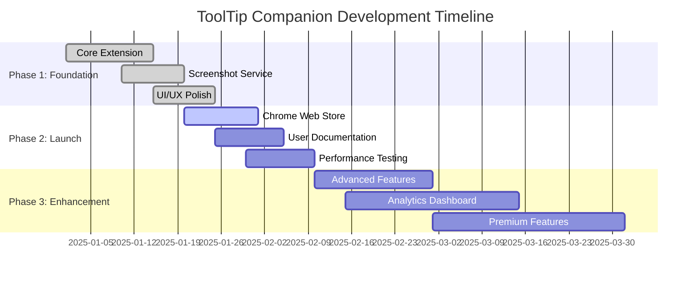

# 🗺️ Development Roadmap

> **Strategic development plan for ToolTip Companion Chrome Extension**

## 📅 Timeline Overview

## 🎯 Phase 1: Foundation (Completed ✅)

### Core Extension Features
- [x] **Basic tooltip system** with hover/click triggers
- [x] **Grey glassmorphism theme** with gradients and blur
- [x] **Draggable tooltips** with smooth animations
- [x] **Resizable interface** with 8 resize handles
- [x] **Collapsible design** with minimize/expand
- [x] **Smart positioning** with viewport boundary detection
- [x] **Settings management** with persistent storage

### Screenshot Service
- [x] **Playwright integration** for browser automation
- [x] **Link preview capture** with metadata extraction
- [x] **Production-ready service** with security features
- [x] **Rate limiting** and abuse prevention
- [x] **Auto cleanup** for storage management
- [x] **Error handling** and graceful fallbacks

### UI/UX Polish
- [x] **Modern glassmorphism design** with CSS effects
- [x] **Smooth animations** and transitions
- [x] **Responsive layout** for different screen sizes
- [x] **Accessibility features** (reduced motion support)
- [x] **Dark/light mode** compatibility

## 🚀 Phase 2: Launch (In Progress 🚧)

### Chrome Web Store Submission
- [ ] **Extension packaging** and optimization
- [ ] **Store listing** with screenshots and description
- [ ] **Privacy policy** and terms of service
- [ ] **Review submission** and approval process
- [ ] **Launch announcement** and marketing

**Target Date**: February 1, 2025

### User Documentation
- [ ] **Installation guide** with step-by-step instructions
- [ ] **Feature tutorials** with video demonstrations
- [ ] **FAQ section** addressing common questions
- [ ] **Troubleshooting guide** for common issues
- [ ] **User feedback system** integration

**Target Date**: February 5, 2025

### Performance & Testing
- [ ] **Cross-browser testing** (Chrome, Edge, Brave)
- [ ] **Performance optimization** for large websites
- [ ] **Memory usage optimization** for long sessions
- [ ] **Load testing** for screenshot service
- [ ] **User acceptance testing** with beta users

**Target Date**: February 10, 2025

## 🔮 Phase 3: Enhancement (Planned 📋)

### Advanced Features
- [ ] **GIF generation** for interaction previews
- [ ] **Custom tooltip themes** and personalization
- [ ] **Keyboard shortcuts** for power users
- [ ] **Bulk screenshot capture** for multiple links
- [ ] **Advanced AI analysis** with external APIs
- [ ] **Element highlighting** and annotation

**Target Date**: March 1, 2025

### Analytics Dashboard
- [ ] **Usage analytics** and metrics collection
- [ ] **Performance monitoring** and alerting
- [ ] **User behavior insights** (anonymized)
- [ ] **Error tracking** and crash reporting
- [ ] **A/B testing framework** for feature validation
- [ ] **Admin dashboard** for service management

**Target Date**: March 15, 2025

### Premium Features
- [ ] **Subscription model** for advanced features
- [ ] **Custom branding** for enterprise users
- [ ] **API access** for third-party integrations
- [ ] **Priority support** for premium users
- [ ] **Advanced screenshot options** (full page, specific regions)
- [ ] **Team collaboration** features

**Target Date**: April 1, 2025

## 🎨 Design Evolution

### Current Design (v1.0)
- **Grey glassmorphism theme** with subtle gradients
- **Minimalist interface** with essential controls
- **Smooth animations** and transitions
- **Responsive design** for all screen sizes

### Future Design (v2.0+)
- [ ] **Multiple themes** (dark, light, custom)
- [ ] **Customizable colors** and branding
- [ ] **Advanced animations** and micro-interactions
- [ ] **Accessibility improvements** (high contrast, screen reader support)
- [ ] **Mobile optimization** for tablet users

## 🔧 Technical Improvements

### Performance Optimization
- [ ] **Lazy loading** for screenshot images
- [ ] **Caching strategies** for frequently accessed data
- [ ] **Bundle size reduction** for faster loading
- [ ] **Memory leak prevention** and cleanup
- [ ] **Background processing** for heavy operations

### Security Enhancements
- [ ] **Content Security Policy** implementation
- [ ] **Input sanitization** for user data
- [ ] **API authentication** for premium features
- [ ] **Privacy compliance** (GDPR, CCPA)
- [ ] **Security audit** and penetration testing

### Scalability
- [ ] **Microservices architecture** for screenshot service
- [ ] **Load balancing** for high traffic
- [ ] **CDN integration** for global performance
- [ ] **Database optimization** for metadata storage
- [ ] **Auto-scaling** infrastructure

## 📊 Success Metrics

### Phase 2 Goals
- **1,000+ installs** in first month
- **4.5+ star rating** on Chrome Web Store
- **<2 second** tooltip response time
- **99.9% uptime** for screenshot service
- **<1% error rate** across all features

### Phase 3 Goals
- **10,000+ active users**
- **Premium conversion** rate >5%
- **User retention** rate >60% after 30 days
- **Feature adoption** rate >80% for core features
- **Customer satisfaction** score >4.0/5.0

## 🎯 Feature Prioritization

### High Priority (Must Have)
1. **Chrome Web Store launch** - Critical for user acquisition
2. **Performance optimization** - Essential for user experience
3. **Error handling improvements** - Reduces support burden
4. **User documentation** - Improves adoption and retention

### Medium Priority (Should Have)
1. **Custom themes** - Differentiates from competitors
2. **Advanced AI analysis** - Core value proposition
3. **Analytics dashboard** - Data-driven decision making
4. **Mobile optimization** - Expands user base

### Low Priority (Nice to Have)
1. **GIF generation** - Nice feature but not essential
2. **Team collaboration** - Enterprise feature
3. **Third-party integrations** - Ecosystem expansion
4. **Advanced customization** - Power user feature

## 🤝 Team Collaboration

### Frontend Developer Responsibilities
- **UI/UX implementation** and polish
- **Cross-browser compatibility** testing
- **Performance optimization** for extension
- **User experience** improvements
- **Accessibility** enhancements

### Backend Developer Responsibilities
- **Screenshot service** maintenance and scaling
- **API development** for advanced features
- **Database design** and optimization
- **Security implementation** and monitoring
- **Infrastructure** management

### Product Manager Responsibilities
- **Feature prioritization** and roadmap management
- **User research** and feedback analysis
- **Market analysis** and competitive positioning
- **Launch strategy** and go-to-market planning
- **Success metrics** tracking and reporting

## 📈 Future Vision

### Long-term Goals (6+ months)
- **Multi-platform expansion** (Firefox, Safari, Edge)
- **Enterprise partnerships** and integrations
- **AI-powered insights** with machine learning
- **Global localization** (multiple languages)
- **Open source community** building

### Innovation Opportunities
- **AR/VR integration** for immersive browsing
- **Voice control** for accessibility
- **Blockchain integration** for data ownership
- **IoT connectivity** for smart browsing
- **Advanced analytics** with predictive insights

---

**This roadmap is a living document that will evolve based on user feedback, market conditions, and technical capabilities. Regular reviews and updates ensure we stay aligned with our goals and user needs.**
